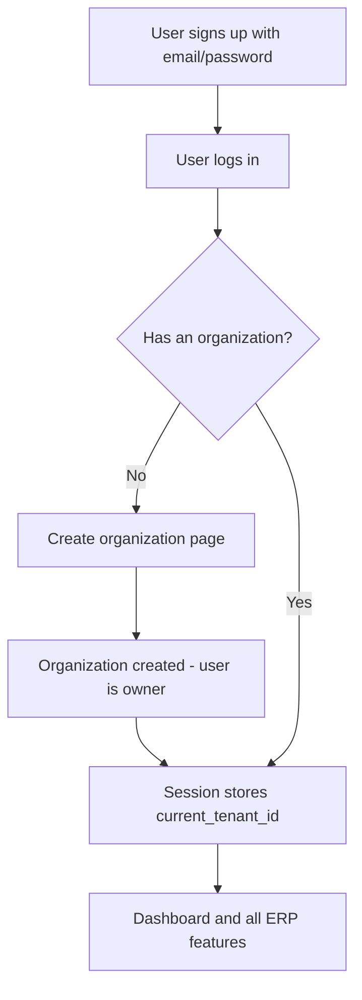
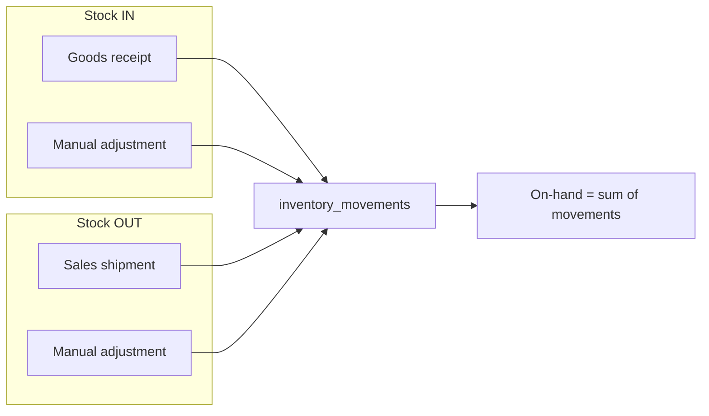
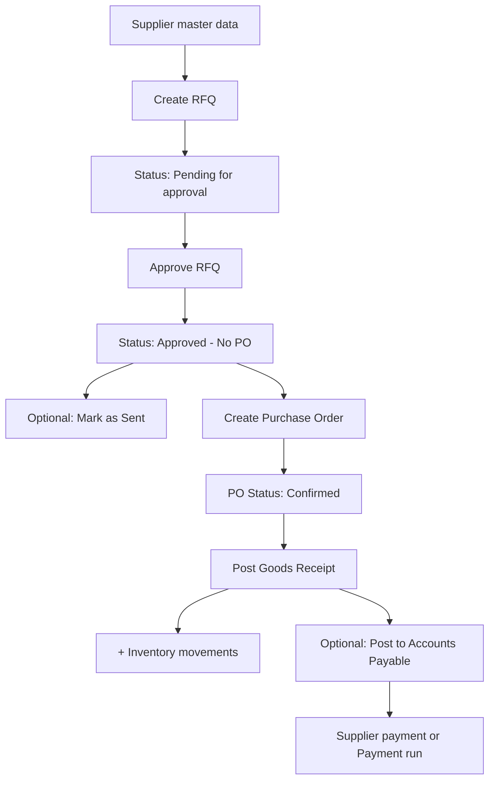
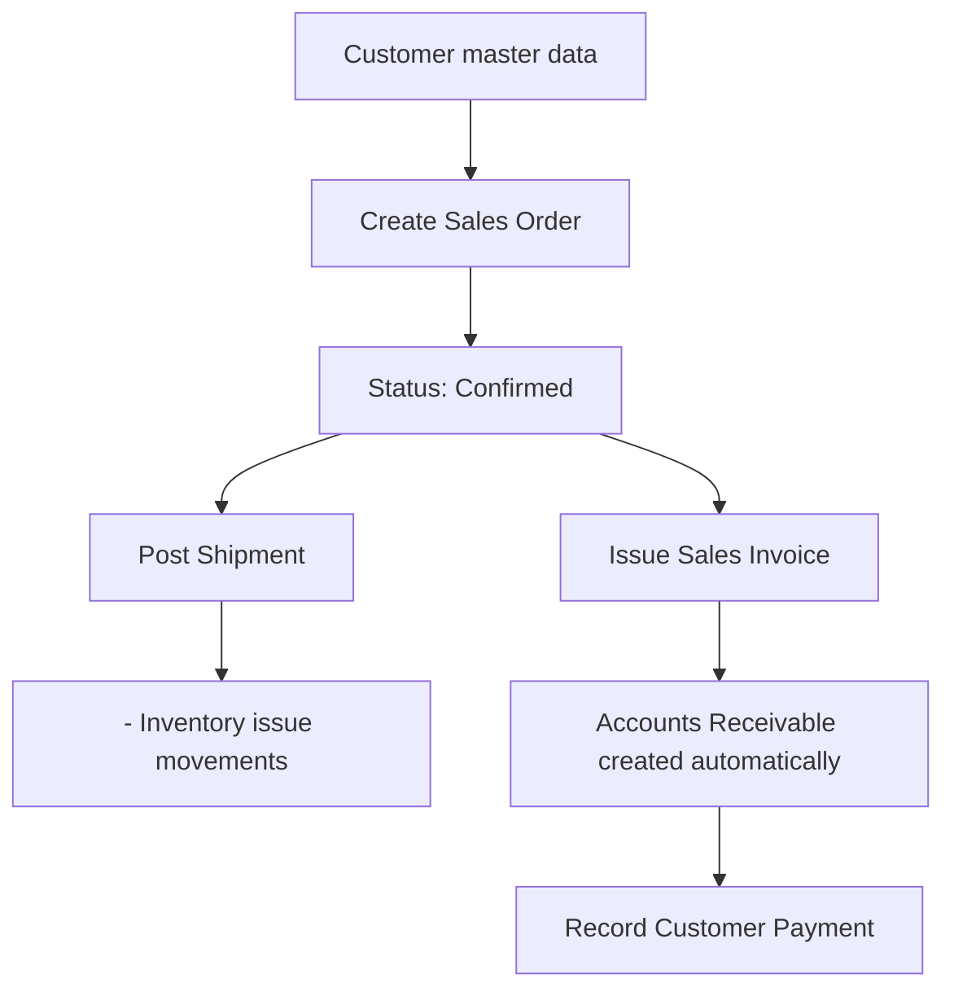
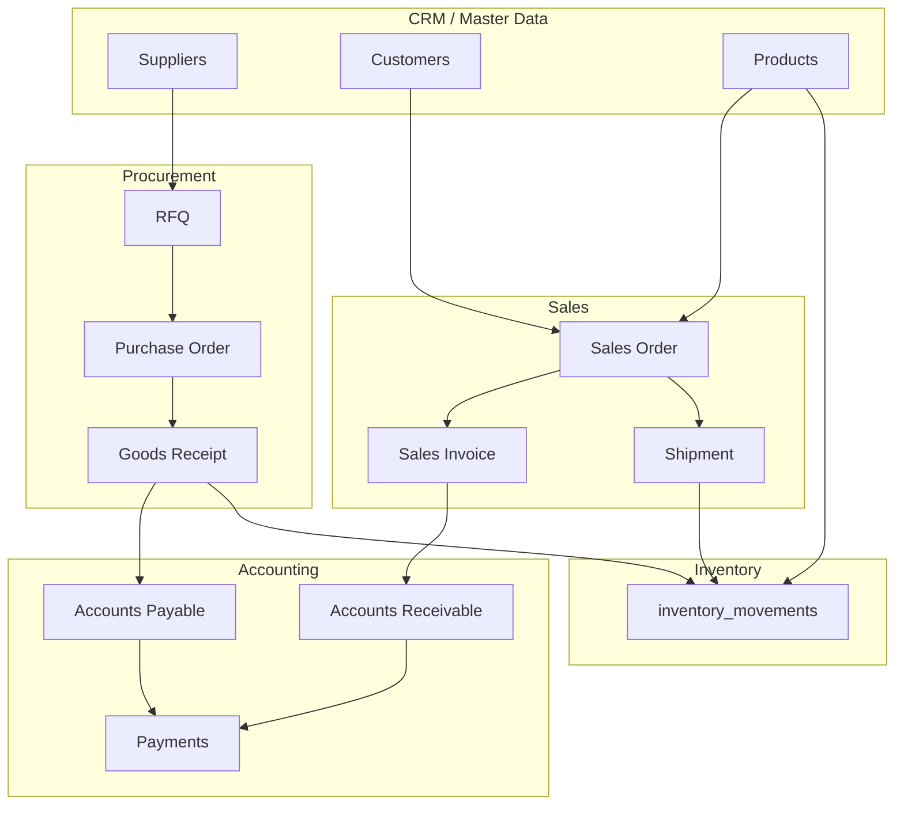

# End-to-end system overview

Plain-language walkthrough of how JMC ERP works from first login through buying, stock, selling, and money tracking. For module detail, see [Modules](modules/overview.md). For shorter flow diagrams, see [Business flows](flows/README.md).

## Summary

JMC ERP is a **multi-tenant business software** (SaaS) for organizations that need integrated procurement, inventory, sales, accounting, and CRM on one platform. One company equals one **organization (tenant)**. Each organization runs its own buying, stock, selling, and money tracking without seeing other companies' data.

**In one sentence:** Set up **who you buy from and sell to** and **what you stock**, then run two main loops — **buying** (procurement) and **selling** (sales) — while **inventory** records every stock change and **accounting** tracks what you owe suppliers and what customers owe you.

## Core principles

- **Tenant isolation:** All business data is scoped to an organization (`tenant_id` on every tenant-owned table).
- **Operational truth:** Stock changes are recorded only through **`inventory_movements`**, not ad hoc quantity fields on products.
- **Thin UI, rich domain:** Livewire pages orchestrate; business rules live in service classes under `app/Domains/`.

See also [Product overview](product-overview.md) and [Technical architecture](technical-architecture.md).

---

## Getting into the system

Registration and organization creation are **decoupled**.



| Step | What happens |
|------|----------------|
| 1. Sign up | Account only — no company yet (`tenant_user` empty). |
| 2. Log in | Normal session authentication (Laravel Fortify). |
| 3. Create organization | If the user has no membership, redirect to `organization/create`. |
| 4. Work in ERP | Middleware (`EnsureTenantContext`) sets `current_tenant_id` and scopes all queries by tenant. |

Routes that require ERP context use the `tenant.context` middleware. Settings such as organization profile are also tenant-scoped.

---

## Foundation data (master records)

Before daily operations, maintain reference data:

| Area | What you store | Used by |
|------|----------------|---------|
| **Products** | Items you buy, sell, and stock (SKU, categories, reorder levels) | Procurement, inventory, sales |
| **Suppliers** | Vendors you buy from | RFQs, purchase orders, accounts payable |
| **Customers** | Buyers you sell to | Sales orders, accounts receivable |

**Stock rule:** Products do **not** store on-hand quantity as a standalone field. On-hand is the **sum of `inventory_movements.quantity`** for that product within the tenant.

See [Data model](data-model.md) and [CRM module](modules/crm.md).

---

## Inventory — the central stock ledger

Inventory is the **single source of truth** for quantity on hand.



### Movement types

| Type | Typical source |
|------|----------------|
| `receipt` | Goods receipt (procurement) |
| `issue` | Sales shipment |
| `adjustment` | Manual correction |
| `transfer` | Transfers (when modeled) |

### UI entry points

- **Products** — product master and per-product activity
- **Inventory** — movement list and manual adjustments

All stock changes go through `PostInventoryMovementService`; receiving and shipping call it inside their own transactions.

See [Inventory module](modules/inventory.md).

---

## Procurement flow (buying)

How the organization **buys stock from suppliers**.



### Step-by-step

1. **RFQ (Request for Quotation)** — Ask a supplier for prices and quantities. Starts as **Pending for approval**.
2. **Approve RFQ** — Internal approval moves status to **Approved - No PO**. Optionally mark **Sent** to the supplier.
3. **Purchase Order** — Commit to buy. Can be created from an approved RFQ (lines and prices copied) or directly. Status: `confirmed` → `partially_received` → `received` (or `cancelled`). **No stock change on PO creation.**
4. **Goods Receipt** — Record what arrived against the PO. In one transaction: receipt document, **inventory receipt movements**, PO status update.
5. **Accounts Payable** — **Manual step:** post AP from a posted goods receipt. Amount = received quantity × unit cost. Supplier invoice reference can be captured on the receipt.
6. **Pay suppliers** — Single supplier payment or **payment run** (draft → approved → processing → completed).

See [Procurement module](modules/procurement.md) and [Procurement flow](flows/procurement.md).

---

## Sales flow (selling)

How the organization **sells to customers**.



### Step-by-step

1. **Sales Order** — Customer order with products, quantities, and prices. Status: `confirmed` → `partially_fulfilled` → `fulfilled`.
2. **Shipment** — On ship: verify sufficient on-hand stock, create shipment, post **issue** movements (stock decreases).
3. **Sales Invoice** — Bill the customer (full or partial). **AR is created automatically** when the invoice is issued.
4. **Customer Payment** — Record payment and allocate to open receivables. Status: `open` → `partial` → `paid`.

**Note:** Shipping and invoicing are separate. Invoice quantities cannot exceed ordered quantities; fulfillment is tracked via shipments.

See [Sales module](modules/sales.md) and [Sales flow](flows/sales.md).

---

## Accounting (money in / money out)

| Side | Created when | Paid when |
|------|--------------|-----------|
| **Accounts Payable (AP)** | Explicit post from a posted goods receipt | Supplier payment or payment run |
| **Accounts Receivable (AR)** | Automatically when a sales invoice is issued | Customer payment |

AP rows include invoice metadata (`invoice_number`, `due_date`, `payment_terms_days`, `priority`) for aging and prioritization. Payment runs batch supplier payouts with approval workflow.

See [Accounting module](modules/accounting.md).

---

## How modules connect



- **CRM** feeds party master data; it does not replace document workflows.
- **Inventory** is the quantity ledger between procurement and sales.
- **Accounting** summarizes payables and receivables tied to operational documents.

---

## Application navigation

Sidebar structure (tenant-scoped routes):

| Section | Pages |
|---------|--------|
| Platform | Dashboard, Products, Inventory |
| Procurement | Suppliers, RFQs, Purchase Orders, Receipts (Stock In) |
| Sales | Customers, Sales Orders |
| Accounting | Accounts Payable, Accounts Receivable, Supplier Payments, Payment Runs, Customer Payments |

The **dashboard** is currently a placeholder; operational work happens in module pages.

---

## Day-in-the-life example

**Morning — buying**

1. Create RFQ to Supplier A for 100 widgets → approve → create PO.
2. Goods arrive → post goods receipt → stock +100.
3. Post AP from receipt → amount owed to Supplier A recorded.
4. Record supplier payment or add to a payment run.

**Afternoon — selling**

1. Customer B orders 20 widgets → create sales order.
2. Ship 20 widgets → stock −20 (if sufficient on hand).
3. Issue invoice → AR created for Customer B.
4. Customer pays → record payment against AR.

**Anytime**

- Review product on-hand and movement history.
- Post manual inventory adjustments (cycle count, damage, etc.).

---

## Technical implementation shape

```
User (Livewire UI) → Service classes → Database models
```

| Layer | Location |
|-------|----------|
| UI | Livewire single-file components under `resources/views/pages/` |
| Business logic | `app/Domains/{Procurement,Inventory,Sales,Accounting,Crm,Tenancy}/Services/` |
| Data | Eloquent models under `app/Models/` |
| Tenancy | `tenant_id` on all tenant-owned tables; session `current_tenant_id` |

Critical operations (receiving, shipping, invoicing, payments) run inside **database transactions**.

Implementation order for new features: migration → model → policy → form request → service → UI. See [Development phases](development-phases.md) and [Development conventions](development-conventions.md).

---

## MVP scope reference

**In scope**

- RFQ → PO → receiving → inventory → AP → supplier payments (including payment runs)
- Sales order → shipment → invoice → AR → customer payments
- Inventory ledger and adjustments
- Multi-tenant organization onboarding

**Out of scope (MVP)**

- Native mobile applications
- AI-driven analytics or ML forecasting
- Rich dashboard KPIs

See [MVP scope](mvp-scope.md).

---

## Related documentation

| Topic | Document |
|-------|----------|
| Product vision | [product-overview.md](product-overview.md) |
| Schema | [data-model.md](data-model.md) |
| Build order | [development-phases.md](development-phases.md) |
| Short procurement/sales flows | [flows/README.md](flows/README.md) |
| Module boundaries | [modules/overview.md](modules/overview.md) |
